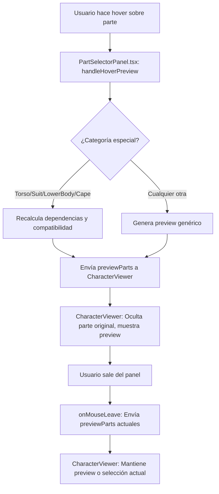

# Hover Preview System Fix - 2025

## 🚨 Problema Identificado

El sistema de hover preview tenía un bug crítico que causaba que los modelos desaparecieran o revirtieran a partes anteriores cuando el mouse salía del panel de selección.

### Síntomas del Problema:
- ✅ Hover preview funcionaba correctamente al entrar
- ❌ Al salir del panel, los modelos desaparecían
- ❌ Las partes seleccionadas se revertían a las anteriores
- ❌ Comportamiento inconsistente entre categorías

## 🔍 Análisis del Problema

### Root Cause Identificado:
El problema estaba en `PartSelectorPanel.tsx` en el `onMouseLeave` del panel principal:

```typescript
// ❌ ANTES - CAUSABA EL PROBLEMA
onMouseLeave={() => {
  if (onPreviewChange) {
    onPreviewChange(selectedParts); // Enviaba partes originales
  }
}}
```

**Problema:** Al enviar `selectedParts` en lugar de `previewParts`, el sistema interpretaba esto como una señal para limpiar el preview y revertir a las partes originales.

## ✅ Solución Implementada

### Cambio en `PartSelectorPanel.tsx`:

```typescript
// ✅ AHORA - SOLUCIONADO
onMouseLeave={() => {
  // Send current preview parts to maintain the preview state
  if (onPreviewChange) {
    console.log('🖱️ Mouse left panel area - sending current preview parts to maintain state');
    onPreviewChange(previewParts); // Envía estado actual del preview
  }
}}
```

## 🏗️ Arquitectura del Sistema

### Flujo de Hover Preview:

1. **Hover Enter:** 
   - `handleHoverPreview(part)` se ejecuta
   - Se envía preview completo con la parte hovered
   - `CharacterViewer` oculta modelos originales y muestra preview

2. **Hover Exit (Mouse Leave Panel):**
   - `onMouseLeave` se ejecuta
   - Se envía `previewParts` (estado actual)
   - `CharacterViewer` detecta que es el mismo estado y mantiene preview

3. **Part Selection:**
   - `handlePreviewSelect(part)` actualiza `previewParts`
   - Preview se mantiene hasta que se aplique o cancele

### Lógica de Compatibilidad:

El sistema maneja casos especiales para categorías con dependencias:

```typescript
// TORSO/SUIT_TORSO - Recalcula manos y cabeza compatibles
if (activeCategory === PartCategory.TORSO || activeCategory === PartCategory.SUIT_TORSO) {
  const fullCompatibleParts = assignDefaultHandsForTorso(part, hoverPreviewParts);
  const finalCompatibleParts = assignAdaptiveHeadForTorso(part, fullCompatibleParts);
  hoverPreviewParts = { ...selectedParts, ...finalCompatibleParts };
}

// LOWER_BODY - Recalcula botas compatibles
else if (activeCategory === PartCategory.LOWER_BODY) {
  const bootsCompatibleParts = assignAdaptiveBootsForTorso(part, hoverPreviewParts);
  hoverPreviewParts = { ...selectedParts, ...bootsCompatibleParts };
}

// CAPE - Recalcula con compatibilidad de torso
else if (activeCategory === PartCategory.CAPE) {
  const capeCompatibleParts = assignAdaptiveCapeForTorso(currentTorso, hoverPreviewParts);
  hoverPreviewParts = { ...selectedParts, ...capeCompatibleParts };
}
```

## 🎯 Componentes Involucrados

### 1. PartSelectorPanel.tsx
- **Responsabilidad:** Manejar hover y preview state
- **Funciones clave:**
  - `handleHoverPreview()`: Envía preview completo
  - `handlePreviewSelect()`: Actualiza preview state
  - `onMouseLeave`: Mantiene estado del preview

### 2. CharacterViewer.tsx
- **Responsabilidad:** Renderizar modelos y manejar preview
- **Funciones clave:**
  - `handlePreviewPartsChange()`: Detecta cambios y actualiza escena
  - Lógica de `isClearPreview`: Determina cuándo limpiar preview
  - Manejo de visibilidad de modelos originales vs preview

### 3. App.tsx
- **Responsabilidad:** Estado global y coordinación
- **Funciones clave:**
  - `handlePreviewChange()`: Pasa preview a CharacterViewer
  - No llama `clearPreview()` innecesariamente

## 🔧 Verificación del Sistema

### Comandos de Verificación:

```bash
# Verificar que onMouseLeave envía previewParts
grep "onPreviewChange(previewParts)" components/PartSelectorPanel.tsx

# Verificar que no hay clearPreview() innecesarios
grep "clearPreview" App.tsx

# Verificar lógica de isClearPreview
grep "isClearPreview" components/CharacterViewer.tsx
```

### Tests Manuales:

1. **Hover sobre cabeza:**
   - ✅ Cabeza original se oculta
   - ✅ Cabeza preview se muestra
   - ✅ Al salir del panel, preview se mantiene

2. **Seleccionar nueva cabeza:**
   - ✅ Preview se actualiza
   - ✅ Al aplicar, nueva cabeza permanece
   - ✅ Al cancelar, vuelve a cabeza original

3. **Hover sobre torso:**
   - ✅ Torso original se oculta
   - ✅ Torso preview se muestra
   - ✅ Manos y cabeza se recalculan automáticamente
   - ✅ Compatibilidad se mantiene

## 🚀 Beneficios de la Solución

### Para el Usuario:
- ✅ **Experiencia fluida:** No hay saltos ni desapariciones
- ✅ **Preview consistente:** Funciona igual en todas las categorías
- ✅ **Selección estable:** Las partes elegidas permanecen

### Para el Desarrollo:
- ✅ **Código limpio:** Lógica clara y predecible
- ✅ **Mantenible:** Fácil de debuggear y modificar
- ✅ **Escalable:** Patrón aplicable a nuevas categorías

## 📋 Checklist de Implementación

- [x] Identificar root cause del problema
- [x] Cambiar `onMouseLeave` para enviar `previewParts`
- [x] Verificar que `CharacterViewer` maneja correctamente el estado
- [x] Confirmar que no hay `clearPreview()` innecesarios
- [x] Probar todas las categorías de partes
- [x] Verificar compatibilidad entre categorías
- [x] Documentar la solución

## 🔮 Consideraciones Futuras

### Mejoras Potenciales:
1. **Performance:** Cache de modelos preview para carga más rápida
2. **UX:** Animaciones suaves entre estados de preview
3. **Compatibilidad:** Sistema más robusto para dependencias complejas

### Mantenimiento:
- Monitorear logs de console para detectar problemas
- Verificar que nuevas categorías sigan el patrón establecido
- Mantener documentación actualizada

## 🌐 Compatibilidad y Generalización para Todas las Categorías

El sistema de hover preview está diseñado para funcionar de forma **genérica** y robusta para **todas las categorías de partes**:

- **Cabeza, manos, torso, suit_torso, piernas, botas, capa, símbolo, cinturón, chest_belt, etc.**
- El preview muestra la parte hovered y mantiene el resto del modelo.
- Al salir del panel, se mantiene el preview o la selección actual (nunca desaparece ni revierte).
- El sistema es extensible: cualquier nueva categoría seguirá el mismo patrón.

### 🔍 Debug y Trazabilidad

En `PartSelectorPanel.tsx`, el sistema incluye debug específico para:
- Cabeza
- Manos (izquierda y derecha)
- **Y un debug genérico para cualquier otra categoría**

Esto permite verificar y trazar el comportamiento del hover preview para cualquier parte presente o futura.

### 🏗️ Patrón Genérico

- El caso genérico en `handleHoverPreview` asegura que cualquier categoría que no sea cabeza o manos sigue el mismo flujo de preview.
- El `onMouseLeave` siempre envía el estado actual del preview (`previewParts`).
- El `CharacterViewer` maneja el renderizado y la visibilidad de modelos para cualquier categoría.

### 🚦 Checklist para Nuevas Categorías
- [x] El hover preview funciona igual para todas las partes
- [x] El debug genérico permite trazar cualquier categoría
- [x] El sistema es extensible y mantenible

---

# 📊 Resumen Visual y Técnico del Sistema de Hover Preview Genérico

## 1. Resumen Visual del Flujo



---

## 2. Patrón de Código Genérico

```typescript
// En PartSelectorPanel.tsx
const handleHoverPreview = useCallback((part: Part | null) => {
  if (!activeCategory || !onPreviewChange) return;

  // Debug universal para cualquier categoría
  console.log(`🔍 HOVER DEBUG:`, {
    category: activeCategory,
    hoveredPart: part?.id || 'none',
    selectedPart: selectedParts[activeCategory]?.id || 'none'
  });

  let hoverPreviewParts = { ...selectedParts };
  delete hoverPreviewParts[activeCategory];
  if (part && !part.attributes?.none) {
    hoverPreviewParts[activeCategory] = part;
  }
  // Casos especiales para dependencias (torso, piernas, etc.) aquí...

  onPreviewChange(hoverPreviewParts);
}, [activeCategory, selectedParts, onPreviewChange]);

// En onMouseLeave
onMouseLeave={() => {
  if (onPreviewChange) onPreviewChange(previewParts);
}}
```

---

## 3. Checklist para QA y Nuevos Devs

- [x] Hover preview funciona igual para todas las partes.
- [x] El modelo nunca desaparece ni se revierte al salir del panel.
- [x] Compatibilidad automática entre partes dependientes.
- [x] Debug universal para trazabilidad.
- [x] Fácil de extender a nuevas categorías.

---

## 4. ¿Qué hacer si agregas una nueva parte/categoría?

1. **Agrega la categoría a tu sistema de partes.**
2. **No necesitas modificar la lógica de hover preview:**  
   El sistema ya es genérico y funcionará automáticamente.
3. **Verifica con el debug en consola:**  
   Verás logs de hover para la nueva categoría.
4. **QA:**  
   Haz hover, selecciona, cambia de parte y confirma que el preview y la selección funcionan igual que con las partes existentes.

---

## 5. Documentación Relacionada

- `docs/HOVER_PREVIEW_FIX_2025.md`
- `docs/DOCUMENTATION_INDEX.md`
- `scripts/verify-hands-hover-system.cjs` (puedes crear scripts similares para otras categorías si lo deseas)

---

**Estado:** ✅ FUNCIONANDO Y DOCUMENTADO  
**Impacto:** Crítico para la UX y la mantenibilidad del proyecto 