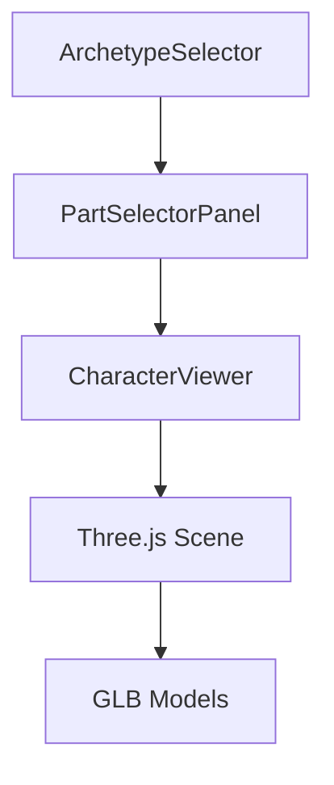

# Arquitectura del Proyecto

Esta carpeta contiene la documentación relacionada con la arquitectura y estructura del proyecto.

## Documentación Disponible

1. [Guía de Arquitectura](architecture-guide.md)
   - Estructura del proyecto
   - Componentes principales
   - Flujo de datos
   - Patrones de diseño
   - Integración con Three.js

## Estructura del Proyecto

```
3dcustomicerdefinitivo/
├── public/
│   ├── assets/
│   │   ├── fuerte/
│   │   ├── agil/
│   │   ├── magico/
│   │   ├── tech/
│   │   └── justiciero/
│   └── draco/
├── src/
│   ├── components/
│   │   ├── ui/
│   │   └── [componentes específicos]
│   ├── lib/
│   ├── types/
│   └── utils/
├── docs/
│   ├── architecture/
│   ├── guides/
│   └── issues/
└── tests/
```

## Componentes Principales

1. **CharacterViewer**
   - Visualización 3D
   - Carga de modelos
   - Controles de cámara

2. **PartSelectorPanel**
   - Selección de partes
   - Filtrado
   - Compatibilidad

3. **ArchetypeSelector**
   - Cambio de arquetipo
   - Gestión de estado
   - UI/UX

## Flujo de Datos



## Mejores Prácticas

- Mantener la documentación actualizada
- Seguir los patrones establecidos
- Documentar cambios arquitectónicos
- Validar decisiones de diseño 