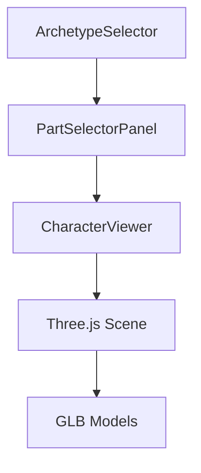

# Guía de Arquitectura

## Estructura del Proyecto

```
3dcustomicerdefinitivo/
├── public/
│   ├── assets/
│   │   ├── fuerte/
│   │   ├── agil/
│   │   ├── magico/
│   │   ├── tech/
│   │   └── justiciero/
│   └── draco/
├── src/
│   ├── components/
│   │   ├── ui/
│   │   └── [componentes específicos]
│   ├── lib/
│   ├── types/
│   └── utils/
├── docs/
│   └── solutions/
└── tests/
```

## Componentes Principales

### 1. CharacterViewer
- Responsable de la visualización 3D
- Maneja la escena Three.js
- Gestiona la carga de modelos
- Controla la cámara y la iluminación

### 2. PartSelectorPanel
- Muestra las partes disponibles
- Maneja la selección de partes
- Filtra por categoría y arquetipo
- Gestiona la compatibilidad

### 3. ArchetypeSelector
- Permite cambiar entre arquetipos
- Actualiza las partes disponibles
- Mantiene el estado del arquetipo

## Flujo de Datos



## Estado de la Aplicación

### 1. Estado Global
- Arquetipo seleccionado
- Partes seleccionadas
- Configuración del visor
- Preferencias del usuario

### 2. Estado Local
- Estado de carga
- Estado de la cámara
- Estado de la UI
- Estado de los modelos

## Patrones de Diseño

### 1. Componentes
- Componentes funcionales con hooks
- Props tipadas con TypeScript
- Separación de responsabilidades
- Reutilización de componentes

### 2. Estado
- Uso de Context API
- Hooks personalizados
- Estado local cuando es posible
- Estado global cuando es necesario

### 3. Rendimiento
- Lazy loading de componentes
- Memoización cuando es necesario
- Optimización de renders
- Carga asíncrona de modelos

## Integración con Three.js

### 1. Escena
```typescript
const scene = new THREE.Scene();
scene.background = new THREE.Color(0x1a1a1a);
```

### 2. Cámara
```typescript
const camera = new THREE.PerspectiveCamera(
  75,
  aspectRatio,
  0.1,
  1000
);
```

### 3. Renderer
```typescript
const renderer = new THREE.WebGLRenderer({
  antialias: true,
  alpha: true
});
```

## Manejo de Modelos 3D

### 1. Carga
```typescript
const loader = new GLTFLoader();
const model = await loader.loadAsync(path);
```

### 2. Optimización
- Compresión Draco
- LOD (Level of Detail)
- Culling
- Instancing

### 3. Gestión de Memoria
- Limpieza de modelos no usados
- Pool de objetos
- Garbage collection
- Memory leaks prevention

## Sistema de Eventos

### 1. Eventos de UI
- Selección de partes
- Cambio de arquetipo
- Interacción con controles
- Feedback de usuario

### 2. Eventos de 3D
- Carga de modelos
- Animaciones
- Interacciones
- Colisiones

## Seguridad

### 1. Validación de Datos
- Sanitización de inputs
- Validación de modelos
- Verificación de rutas
- Control de acceso

### 2. Optimización
- Límites de tamaño
- Validación de formatos
- Control de recursos
- Prevención de ataques

## Mejores Prácticas

### 1. Código
- TypeScript estricto
- ESLint + Prettier
- Documentación JSDoc
- Tests unitarios

### 2. Performance
- Code splitting
- Tree shaking
- Bundle optimization
- Caching

### 3. Mantenibilidad
- Nombres descriptivos
- Comentarios claros
- Documentación actualizada
- Refactorización regular

## Referencias

- [React Documentation](https://reactjs.org/docs/getting-started.html)
- [Three.js Documentation](https://threejs.org/docs/)
- [TypeScript Documentation](https://www.typescriptlang.org/docs/)
- [Vite Documentation](https://vitejs.dev/guide/) 