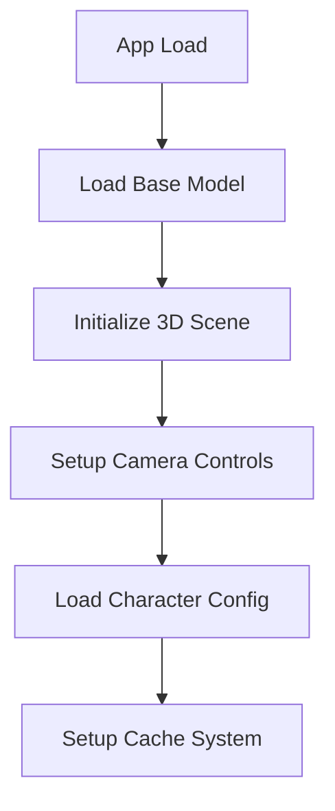
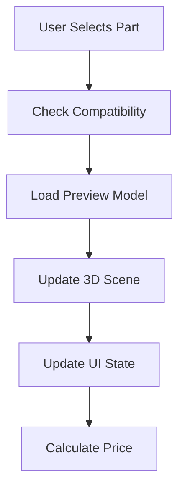
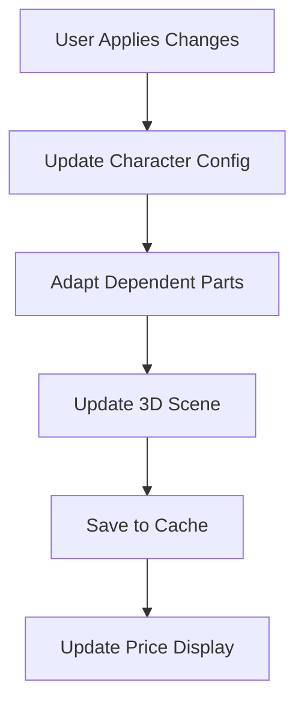

# 🏗️ Project Architecture

## Overview

The **Superhero 3D Customizer** is a modern web application built with React, TypeScript, and Three.js that allows users to interactively customize 3D superhero miniatures with an intuitive and responsive interface.

## 🛠️ Technology Stack

### **Frontend Core**
- **React 18** - Framework principal con hooks modernos
- **TypeScript** - Tipado estático para mejor mantenibilidad
- **Vite** - Build tool rápido y eficiente
- **TailwindCSS** - Framework CSS utility-first

### **3D Graphics**
- **Three.js** - Motor 3D principal
- **OrbitControls** - Controles de cámara personalizados
- **GLTFLoader** - Carga de modelos GLB/GLTF
- **DRACOLoader** - Compresión de geometría para optimización

### **UI/UX Components**
- **Radix UI** - Componentes accesibles y personalizables
- **Lucide React** - Iconografía consistente
- **Custom CSS** - Estilos personalizados y animaciones

### **Development Tools**
- **ESLint** - Linting de código
- **Prettier** - Formateo automático
- **Vitest** - Testing framework (futuro)

## 📁 Project Structure

```
3dcustomicerdefinitivo/
├── components/                    # Componentes React principales
│   ├── CharacterViewer.tsx       # Visor 3D con Three.js
│   ├── PartSelectorPanel.tsx     # Modal de selección de partes
│   ├── CurrentConfigPanel.tsx    # Panel de configuración actual
│   ├── PriceDisplay.tsx          # Display de precios dinámicos
│   ├── CategoryNavigation.tsx    # Navegación por categorías
│   ├── PartItemCard.tsx          # Tarjetas de partes individuales
│   ├── EditingIndicator.tsx      # Indicadores de edición
│   ├── ArchetypeSelector.tsx     # Selector de arquetipos
│   ├── CacheInfo.tsx             # Información de caché
│   ├── Header.tsx                # Header de la aplicación
│   ├── Sidebar.tsx               # Barra lateral
│   └── ui/                       # Componentes UI reutilizables
│       ├── button.tsx
│       ├── card.tsx
│       ├── dialog.tsx
│       └── sheet.tsx
├── public/assets/                # Modelos 3D y recursos
│   ├── strong/                   # Arquetipo Strong
│   │   ├── Base/
│   │   ├── torso/
│   │   ├── hands/
│   │   ├── legs/
│   │   ├── head/
│   │   ├── cape/
│   │   ├── boots/
│   │   └── accessories/
│   ├── justiciero/               # Arquetipo Justiciero
│   └── draco/                    # Decodificador Draco
├── src/                          # Código fuente principal
├── types.ts                      # Definiciones TypeScript
├── constants.ts                  # Constantes y configuraciones
├── utils.ts                      # Utilidades generales
├── lib/utils.ts                  # Utilidades específicas
└── docs/                         # Documentación completa
```

## 🎯 Core Components

### 1. **3D Viewer (`CharacterViewer`)**
```typescript
// Responsabilidades principales:
- Gestión de escena Three.js
- Carga y actualización de modelos
- Control de cámara Y-axis restringido
- Sistema de iluminación y post-processing
- Caché inteligente de modelos
- Optimización de renderizado
```

### 2. **Selection Panel (`PartSelectorPanel`)**
```typescript
// Características:
- Modal overlay sin bloquear visor
- Preview en tiempo real
- Navegación por categorías
- Filtros y búsqueda
- Sistema de compatibilidad
- Responsive design
```

### 3. **Configuration Panel (`CurrentConfigPanel`)**
```typescript
// Funcionalidades:
- Vista actual del personaje
- Precio total en tiempo real
- Información de caché
- Controles de aplicación/cancelación
- Layout responsive
```

### 4. **State Management**
```typescript
// Gestión de estado:
- React Context para estado global
- Configuración de personaje
- Compatibilidad de partes
- Estado de UI y modales
- Caché de modelos
```

## 🔄 Data Flow

### **1. Inicialización**


### **2. Selección de Partes**


### **3. Aplicación de Cambios**


## 🚀 Optimizations

### **Performance**
- **Lazy Loading**: Carga diferida de modelos
- **Model Caching**: Sistema de caché inteligente
- **Geometry Optimization**: Compresión Draco
- **Instance Usage**: Reutilización de geometrías
- **Memory Management**: Limpieza automática de recursos

### **Responsiveness**
- **Breakpoints**: Móvil (640px), Tablet (1024px), Desktop (1024px+)
- **Touch Optimization**: Controles optimizados para táctil
- **Layout Adaptation**: Reorganización automática
- **Performance Monitoring**: Métricas de rendimiento

### **User Experience**
- **Preview System**: Vista previa sin aplicar
- **Visual Feedback**: Indicadores claros de estado
- **Smooth Animations**: Transiciones fluidas
- **Accessibility**: Componentes accesibles

## 🎨 Design System

### **Color Palette**
```css
/* Primary Colors */
--primary: #3b82f6
--primary-dark: #1d4ed8
--secondary: #64748b
--accent: #f59e0b

/* Background Colors */
--bg-primary: #ffffff
--bg-secondary: #f8fafc
--bg-dark: #1e293b

/* Text Colors */
--text-primary: #1e293b
--text-secondary: #64748b
--text-muted: #94a3b8
```

### **Typography**
```css
/* Font Stack */
font-family: 'Inter', -apple-system, BlinkMacSystemFont, sans-serif

/* Scale */
text-xs: 0.75rem
text-sm: 0.875rem
text-base: 1rem
text-lg: 1.125rem
text-xl: 1.25rem
text-2xl: 1.5rem
```

### **Spacing System**
```css
/* Tailwind Spacing Scale */
space-1: 0.25rem
space-2: 0.5rem
space-4: 1rem
space-6: 1.5rem
space-8: 2rem
space-12: 3rem
space-16: 4rem
```

## 🔧 Code Conventions

### **Naming Conventions**
```typescript
// Components: PascalCase
export const CharacterViewer: React.FC = () => {}

// Functions: camelCase
const loadModel = () => {}

// Types/Interfaces: PascalCase
interface CharacterConfig {}

// Constants: UPPER_SNAKE_CASE
const MAX_ZOOM_LEVEL = 10

// Files: kebab-case
character-viewer.tsx
part-selector-panel.tsx
```

### **Component Structure**
```typescript
// 1. Imports
import React, { useState, useEffect } from 'react'
import { useCharacterContext } from '../contexts/CharacterContext'

// 2. Types
interface ComponentProps {
  // Props definition
}

// 3. Component
export const ComponentName: React.FC<ComponentProps> = ({ ...props }) => {
  // 4. Hooks
  const [state, setState] = useState()
  
  // 5. Effects
  useEffect(() => {
    // Side effects
  }, [])
  
  // 6. Handlers
  const handleAction = () => {
    // Event handlers
  }
  
  // 7. Render
  return (
    <div>
      {/* JSX */}
    </div>
  )
}
```

## 🧪 Testing Strategy

### **Testing Levels**
- **Unit Tests**: Funciones utilitarias y lógica de negocio
- **Component Tests**: Componentes UI individuales
- **Integration Tests**: Flujos de usuario completos
- **E2E Tests**: Casos de uso críticos

### **Coverage Goals**
- **Minimum**: 80% coverage
- **Focus**: Business logic y componentes críticos
- **Edge Cases**: Casos límite y errores

## 🚀 Deployment

### **Environments**
```bash
# Development
npm run dev          # http://localhost:5173

# Production Build
npm run build        # Build optimizado
npm run preview      # Preview local
```

### **Build Pipeline**
1. **Lint**: ESLint + Prettier
2. **Type Check**: TypeScript compilation
3. **Build**: Vite production build
4. **Test**: Unit tests (futuro)
5. **Deploy**: Static hosting

## 📊 Monitoring & Analytics

### **Performance Metrics**
- **Load Time**: Tiempo de carga inicial
- **FPS**: Frames por segundo del visor 3D
- **Memory Usage**: Uso de memoria del navegador
- **Model Load Time**: Tiempo de carga de modelos

### **User Analytics**
- **Interaction Tracking**: Clicks y selecciones
- **Error Logging**: Errores de carga y renderizado
- **Performance Monitoring**: Métricas de rendimiento
- **User Flow**: Flujo de usuarios en la aplicación

## 🔮 Future Architecture

### **Planned Improvements**
- **Backend Integration**: API REST para persistencia
- **User Authentication**: Sistema de usuarios
- **Payment Processing**: Integración de pagos
- **STL Export**: Generación de archivos para impresión
- **PWA Support**: Aplicación web progresiva
- **Offline Capabilities**: Funcionamiento sin conexión

### **Scalability Considerations**
- **Microservices**: Arquitectura de servicios
- **CDN**: Distribución de contenido
- **Caching**: Caché distribuido
- **Load Balancing**: Balanceo de carga
- **Database**: Base de datos para configuraciones

---

*Esta arquitectura está diseñada para ser escalable, mantenible y centrada en la experiencia del usuario.* 